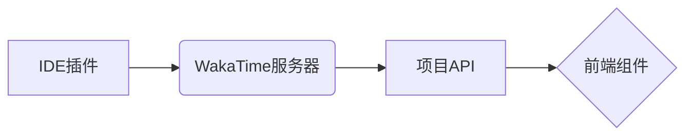

# 刘星余项目文档

## 技术架构
| 技术栈         | 版本   | 用途                 |
|----------------|--------|----------------------|
| Next.js        | 15.3.4 | 全栈框架           |
| TypeScript     | 5.0.4  | 类型安全           |
| Tailwind CSS   | 3.4.1  | UI设计系统         |
| QAnything      | 1.3.0  | 知识库问答         |
| WakaTime       | 1.2.0  | 开发行为分析       |

## 核心功能实现
### QAnything集成
```typescript:%2Fsrc%2Fapp%2Fapi%2Fchat-stream%2Froute.ts
export const runtime = 'edge';

const encoder = new TextEncoder();
responseStream.pipeThrough(new TransformStream({
  transform(chunk, controller) {
    controller.enqueue(encoder.encode(`data: ${JSON.stringify(chunk)}\n\n`));
  }
}));
```

**实现路径：**  
`src/app/api/chat-stream/route.ts`  
实现要点：  
- 使用Edge Runtime处理流式响应  
- 通过SSE协议推送token级结果  
- 集成JWT鉴权中间件  
`src/app/api/youdao-kb-list/route.ts`

**功能特性：**
- 流式问答API接口（SSE协议）
- 知识库管理RESTful接口
- 基于JWT的访问鉴权

### WakaTime集成
**组件位置：**  
`src/app/wakatime-stats.tsx`

**数据流程：**


### 旧作业整合
**目录结构：**
```
src/app/practice/
├── 03-css-01/        # 基础选择器练习
├── 04-css-02/        # 定位布局练习
├── 07-async-01/      # Promise基础
└── embed-demo/       # iframe嵌入示例
```

## 运行指南

### 环境准备
```bash
# 安装依赖
npm install

# 开发模式（端口3000）
npm run dev

# 生产构建
npm run build && npm run start
```

### 环境变量
```env
NEXT_PUBLIC_QIYUE_API_KEY=your_qanything_key
WAKATIME_API_KEY=your_wakatime_key
```

## 项目结构
```
src/app
├── api/              # API路由
│   ├── chat-stream/    # 流式问答
│   └── youdao-kb-list/ # 知识库管理
├── practice/        # 课程作业
├── layout.tsx       # 全局布局
└── page.tsx         # 首页入口
```

## 文档截图
架构图1
({49004764-93A2-430D-9716-6D9AE7076F3E}.png)架构图2
({DB37CF26-44EE-4A39-85BE-A5DB9B5DA4C6}.png)架构图3
({C0ED8979-2777-411D-A0CE-7DA334A6C5FA}.png)时长图 

