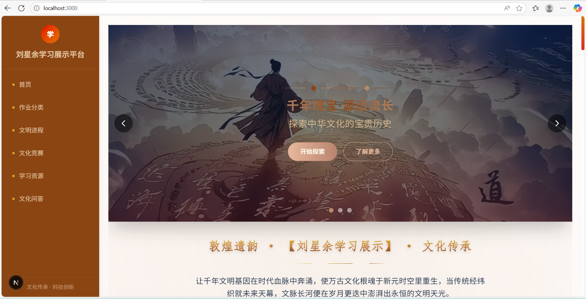
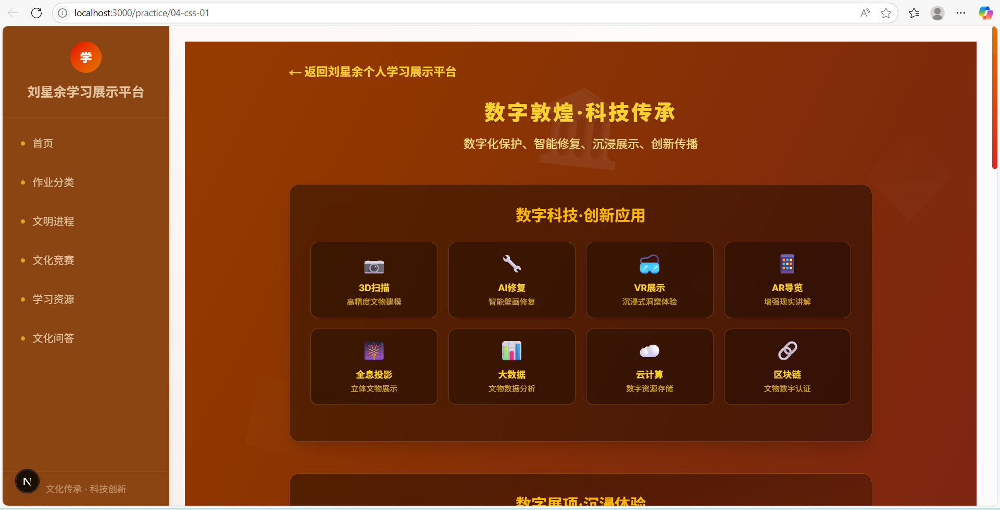
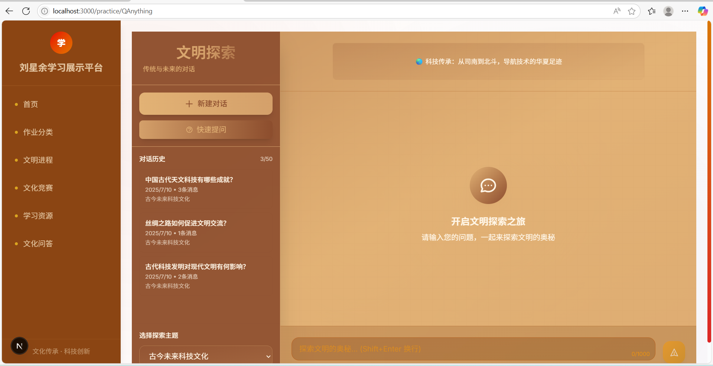

# 刘星余项目文档

## 项目简介

本项目是一个基于 Next.js 框架开发的中国古代科技文化问答网站。项目整合了多个现代化前端技术，旨在为用户提供流畅、直观的古代科技文化知识交互体验。

### 核心功能

- **智能问答系统**：集成 QAnything 知识库，支持用户进行中国古代科技文化相关的精准问答
- **响应式设计**：采用 Tailwind CSS 实现的现代化 UI，确保在各种设备上的最佳显示效果
- **类型安全**：使用 TypeScript 确保代码质量和开发效率
- **开发分析**：通过 WakaTime 跟踪和优化开发流程

### 技术特点

- 采用 Next.js 服务端渲染提升性能和 SEO 效果
- 使用 Tailwind CSS 实现原子化样式管理
- 整合 QAnything 实现智能化知识问答
- 基于 TypeScript 的严格类型检查

### 技术架构

| 工具/框架 | 用途 |
|-----------|------|
| Next.js | 全栈开发框架，提供服务端渲染和 API 路由 |
| TypeScript | 增强代码的类型安全性和可维护性 |
| Tailwind CSS | 原子化 CSS 框架，快速构建现代化 UI |
| QAnything | 智能知识库问答系统，提供精准答案 |
| WakaTime | 追踪开发时间，分析编程行为 |
| Canva | 设计与制作项目展示图片 |

> 项目展示图片素材来源：小红书

## 核心功能实现

### QAnything集成路径与实现细节

#### 1. 核心文件结构

- `src/app/practice/QAnything/page.tsx`：主要界面组件
- `src/app/practice/QAnything/youdao-api.ts`：API集成层

#### 2. 主要功能实现

##### 2.1 知识库管理

- 知识库列表获取与展示
- 知识库选择与切换
- 知识库状态管理

##### 2.2 对话功能

- 消息发送与接收
- 流式响应处理
- 历史记录管理
- 快速问题功能

##### 2.3 状态管理

- 聊天历史记录
- 消息列表
- 加载状态
- 错误处理

##### 2.4 API集成

- 有道QAnything API接入
- 流式数据处理
- 错误码处理
- 认证机制

#### 3. 用户体验优化

- 自动滚动到最新消息
- 加载状态提示
- 错误信息展示
- 响应式布局设计
- 文化小贴士轮播

#### 4. 技术选型及原因

##### 4.1 Next.js框架

- 服务端渲染支持，提升首屏加载速度
- 内置路由系统，简化页面导航
- TypeScript友好，提供类型安全
- API路由功能，便于后端集成

##### 4.2 Tailwind CSS

- 原子化CSS，提高开发效率
- 响应式设计支持
- 自定义主题方便，满足设计需求
- 按需编译，优化打包体积

##### 4.3 有道QAnything API

- 成熟的知识库问答能力
- 流式响应支持，提升用户体验
- 完善的错误处理机制
- 简单的接入方式

### WakaTime API集成路径与实现细节

#### 1. WakaTime核心文件结构

- `src/app/practice/WakaTime/page.tsx`：主要界面组件
- `src/app/practice/WakaTime/wakatime-api.ts`：API集成层

#### 2.  WakaTime主要功能实现

##### 2.1 数据获取

- 编程时长统计
- 项目时间分布
- 语言使用占比
- 编辑器使用情况

##### 2.2 数据可视化

- 时间趋势图表
- 语言分布饼图
- 项目活动热图
- 编辑器使用统计

##### 2.3 WakaTime状态管理

- 数据缓存处理
- 加载状态控制
- 错误信息处理
- 刷新机制

##### 2.4 WakaTime API集成

- WakaTime API认证
- 数据请求封装
- 响应处理
- 错误处理

#### 3. WakaTime用户体验优化

- 数据加载提示
- 图表交互响应
- 自适应布局
- 主题切换支持

#### 4. WakaTime技术栈选择原因

##### 4.1 Chart.js

- 丰富的图表类型
- 良好的性能表现
- 简单的API设计
- 完善的文档支持

##### 4.2 SWR

- 自动数据缓存
- 实时更新支持
- 错误重试机制
- 优化请求策略

##### 4.3 WakaTime API

- RESTful接口设计
- 完整的数据指标
- 稳定的服务保障
- 清晰的接口文档

### Next.js项目结构

#### 1. 根目录配置文件

- `package.json`：项目依赖和脚本配置
- `next.config.ts`：Next.js配置文件
- `tsconfig.json`：TypeScript配置
- `postcss.config.mjs`：PostCSS配置
- `eslint.config.mjs`：ESLint配置
- `.gitignore`：Git忽略文件

#### 2. 源代码目录 (src/)

##### 2.1 应用核心 (app/)

- `layout.tsx`：全局布局组件
- `page.tsx`：首页组件
- `globals.css`：全局样式

##### 2.2 功能模块 (practice/)

- `QAnything/`：智能问答系统
- `WakaTime/`：编程时间统计
- `components/`：共享组件

##### 2.3 API路由 (api/)

- `QAnything/`：知识库接口
- `WakaTime/`：时间统计接口

#### 3. 公共资源 (public/)

- `images/`：图片资源
- `svg/`：SVG图标
- `practice/`：练习资源

#### 4. 样式文件 (styles/)

- `main.css`：主样式文件
- `tailwind/`：Tailwind配置

#### 5. 类型定义 (types/)

- `QAnything.ts`：问答系统类型
- `WakaTime.ts`：时间统计类型
- `common.ts`：通用类型

### 旧作业整合

#### 整合方式

##### 1. 模块化组织

- 每个作业以独立模块形式存在
- 统一放置在 `practice` 目录下
- 保持原有功能完整性

##### 2. 技术升级

- 使用 Next.js 框架重构
- 采用 TypeScript 进行类型约束
- 整合 Tailwind CSS 样式

##### 3. 访问方式

- 通过路由系统访问各作业
- 统一的导航菜单
- 保持URL语义化

#### 项目运行指南

##### 环境要求

- Node.js 18.0.0 或更高版本
- npm 9.0.0 或更高版本

#### 安装步骤

##### 1. 克隆项目

```bash
git clone <项目地址>
cd Liuxingyu

### 项目结构

```

src/app
├── api/              # API路由
│   ├── chat-stream/    # 流式问答
│   └── youdao-kb-list/ # 知识库管理
├── practice/        # 课程作业
├── layout.tsx       # 全局布局
└── page.tsx         # 首页入口
├── QAnything/
├── WakaTime/
├── components/
├── WakaTime/
├── components/

### 文档截图

运行图1
运行图2
运行图3
时长图

